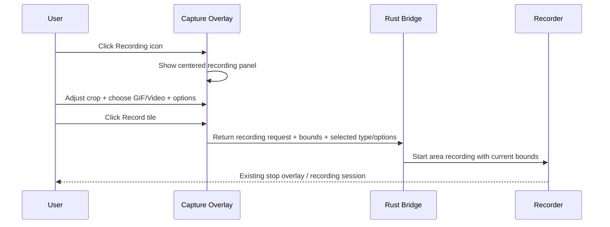

I have created the following plan after thorough exploration and analysis of the codebase. Follow the below plan verbatim. Trust the files and references. Do not re-verify what's written in the plan. Explore only when absolutely necessary. First implement all the proposed file changes and then I'll review all the changes together at the end.

**What I observed**

The primary area-selector UI is the Qt overlay in `file:capture-overlay/src/CaptureOverlay.cpp`, with the GTK version in `file:src/overlay.rs` acting as fallback. The Recording icon already exists beside OCR, but its click path currently falls through to the default confirm flow instead of opening a recording-specific panel. The current size indicator is a separate frosted panel. Recording itself is already implemented in `file:src/recording/mod.rs`, but today it only understands bounds and output type via file extension; it does not yet model mic/speaker/click/keystroke options.

**Chosen approach**

You should extend the existing selector instead of creating a new window. Keep the current toolbar and crop/resize behavior, then add a centered in-selection recording panel that opens from the Recording icon and reuses the existing frosted-glass visual system. Pass only the choices the current recorder can already honor end-to-end now: selected area, GIF vs video, and whether to use the existing stop-controls overlay. Keep the GTK fallback behavior aligned so the contract stays consistent even when the Qt binary is unavailable.

```text
┌──────────────────────────── Capture Area ────────────────────────────┐
│                                                                      │
│                      ┌────── Tools Section ──────┐                   │
│                      │ [Controls] [Size] [Crop]  │                   │
│                      │ [Mic][Spk][Rec][Click][Keys]                 │
│                      └────────────────────────────┘                   │
│                                                                      │
│                     ┌────── Record Type Section ──────┐              │
│                     │      [ Record GIF ] [ Video ]   │              │
│                     └──────────────────────────────────┘              │
│                                                                      │
│   Resize/crop handles remain visible around the capture selection    │
└──────────────────────────────────────────────────────────────────────┘
```



## Implementation instructions

### 1. Add an explicit recording-panel state to the selector
Update `file:capture-overlay/src/CaptureOverlay.h` and `file:capture-overlay/src/CaptureOverlay.cpp` so the overlay can distinguish between:
- normal capture selection
- OCR selection
- scroll selection
- **recording panel open**

Track, at minimum:
- whether the recording panel is open
- selected record type: `GIF` or `Video`
- selected tool toggles for:
  - Controls
  - Mic
  - Speaker
  - Clicks
  - Keystrokes

Also add lightweight accessors so `file:capture-overlay/src/main.cpp` can inspect whether the overlay ended in screenshot mode or recording mode.

### 2. Replace the current Recording click behavior
In `file:capture-overlay/src/CaptureOverlay.cpp`, the Recording toolbar item is currently handled by the generic “confirm selection” path. Replace that behavior so:

- clicking the **existing Recording toolbar icon** opens the new recording panel in the center of the current selection
- it does **not** capture immediately
- the Recording toolbar icon stays visually active while the panel is open
- clicking it again can close the panel if you want a clean toggle, but do not let it fall back to screenshot confirmation

Mirror the same intent in the fallback selector at `file:src/overlay.rs`, where the Recording icon currently has visual presence but no equivalent recording flow.

### 3. Draw the new UI inside the capture area, not outside it
Use the existing frosted-glass styling already implemented in:
- `file:capture-overlay/src/CaptureOverlay.cpp` via `drawFrostedPanel`
- `file:src/overlay.rs` via `draw_frosted_panel`

Add a centered two-rectangle layout:

| Section | Layout | Content |
|---|---|---|
| Tools | 2 rows | Row 1 = 3 columns, Row 2 = 5 columns |
| Record Types | 1 row | `Record GIF`, `Record Video` |

For the tools section, render these tiles in this exact order:

| Row | Slot | Item |
|---|---|---|
| 1 | 1 | Controls |
| 1 | 2 | Size |
| 1 | 3 | Crop |
| 2 | 1 | Mic |
| 2 | 2 | Speaker |
| 2 | 3 | Record |
| 2 | 4 | Click |
| 2 | 5 | Keystrokes |

Important layout rules:
- keep the panel **centered inside the current selection**
- recompute its position every time the selection moves or resizes
- clamp it inside the selection with inner padding
- if the selection becomes small, shrink tile spacing before moving the panel outside, because you explicitly want the UI inside the capture area

### 4. Keep crop control visible and usable at all times
Your key requirement is already compatible with the current overlay: the resize handles and selection border are drawn independently from the toolbar. Preserve that behavior.

Concretely:
- do **not** hide the resize handles while the recording panel is open
- keep edge/corner resize hit-testing active
- let the panel sit in the middle while the user still resizes from the perimeter
- update the size tile live as the selection dimensions change

For recording mode, treat the existing standalone size panel as redundant. Surface the live size readout in the new **Size** tile instead of relying on the separate outer size panel.

### 5. Use the existing drawing style for icons instead of introducing assets
This codebase already draws selector icons procedurally in:
- `file:capture-overlay/src/CaptureOverlay.cpp` via `drawToolbarIcon`
- `file:src/overlay.rs` via `draw_toolbar_icon`

Stay consistent with that pattern:
- add the new recording-panel icons in the same painter-based approach
- reuse current visual states: hover, active, disabled, bright rim, blue active pill
- keep the top toolbar iconography style matched to the new panel

### 6. Define what each tile does now
You should keep the UI faithful to the requested design, but only bind the options the current recorder already supports end-to-end.

| Tile | Expected UX role | What you should wire now |
|---|---|---|
| Controls | whether recording controls are shown while recording | map to the existing stop-overlay path in `file:src/recording/stop_overlay.rs` |
| Size | live capture dimensions | read-only live selection value |
| Crop | keep selection editing obvious | no extra backend action; it reinforces that crop handles remain active |
| Mic | microphone capture | UI state only for now |
| Speaker | system audio capture | UI state only for now |
| Record | start recording | triggers recorder start with current bounds and selected type |
| Click | show clicks | UI state only for now |
| Keystrokes | show keystrokes | UI state only for now |
| Record GIF / Record Video | choose output type | fully wired now |

This keeps the UI accurate without pretending `file:src/recording/mod.rs` already supports audio/click/keystroke capture.

### 7. Extend the overlay result protocol for recording requests
Right now the selector bridge in `file:src/capture_overlay.rs` only understands:
- plain area selection
- scroll result
- OCR result
- window sentinel flow

You should extend that protocol so the overlay can return a **recording request** with:
- selection geometry
- record type (`gif` or `video`)
- controls toggle
- the remaining UI toggle states for future use

Update both sides:
- `file:capture-overlay/src/main.cpp` should emit a recording-specific result instead of taking a screenshot when recording is chosen
- `file:src/capture_overlay.rs` should parse that into a new Rust-side enum/result variant rather than forcing it through the screenshot path

### 8. Hand off from capture UI into the existing recorder flow
Update the capture entry flow in `file:src/main.rs` so `run_capture()` can branch when the area selector returns a recording request.

The handoff should use the existing recorder pieces instead of inventing a second path:
- selected area → `RecordingConfig.x/y/width/height` in `file:src/recording/mod.rs`
- selected type:
  - `GIF` → force `.gif`
  - `Video` → keep the default video path/extension behavior
- Controls toggle:
  - enabled → use the existing stop overlay path already used by the app
  - disabled → start recording without that stop overlay

Do **not** widen `RecordingConfig` yet for mic/speaker/click/keystrokes, because the recorder does not currently consume those fields.

### 9. Keep the fallback overlay behavior aligned
Even though the Qt selector is the main path, you should keep the fallback selector in `file:src/overlay.rs` consistent enough that:
- the Recording icon opens the same centered panel
- the same tiles exist in the same order
- the same recording request contract comes back to Rust

That prevents the UI contract from splitting between the primary and fallback selector implementations.

### 10. Files you should touch conceptually
Most of the work belongs in these areas:

| Responsibility | Files |
|---|---|
| Primary selector state, rendering, hit-testing | `file:capture-overlay/src/CaptureOverlay.h`, `file:capture-overlay/src/CaptureOverlay.cpp` |
| Overlay subprocess output contract | `file:capture-overlay/src/main.cpp` |
| Rust bridge parsing/result enums | `file:src/capture_overlay.rs` |
| Capture flow handoff into recorder | `file:src/main.rs` |
| Existing recorder integration points | `file:src/recording/mod.rs`, `file:src/recording/stop_overlay.rs` |
| Fallback selector parity | `file:src/overlay.rs` |