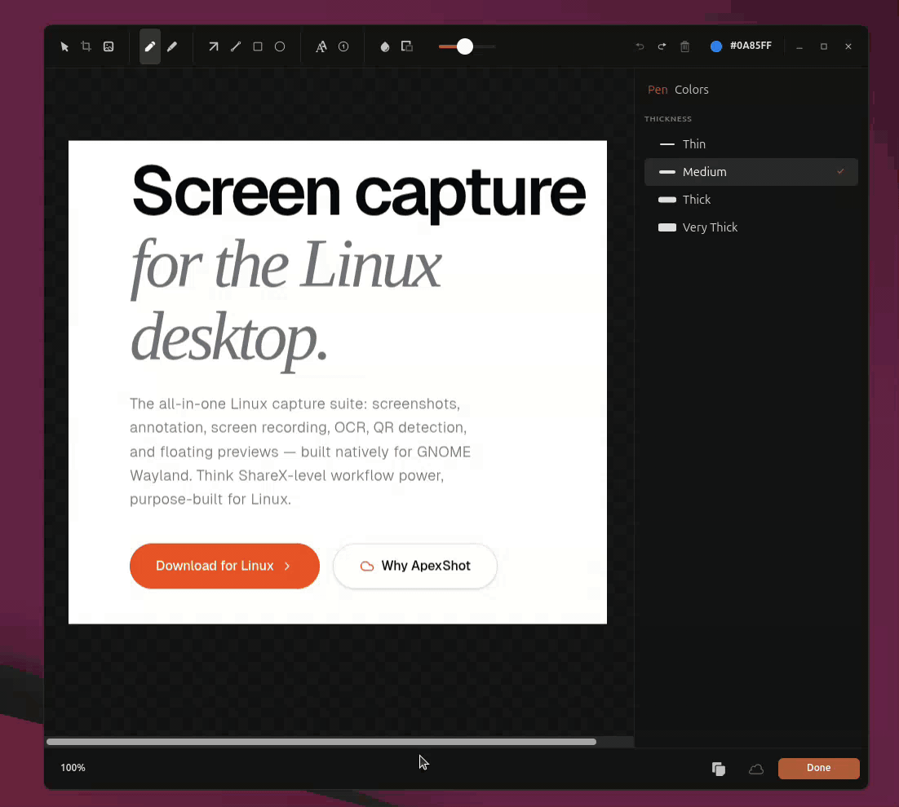
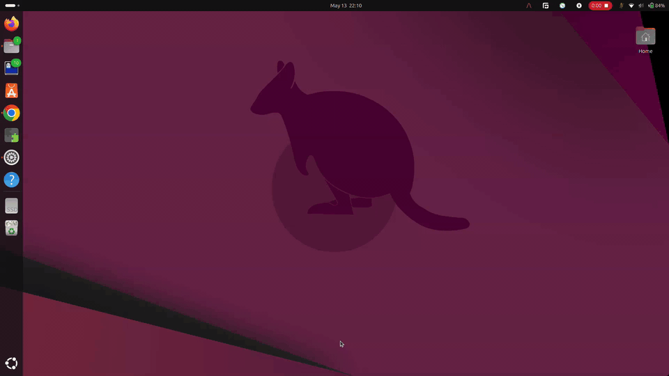
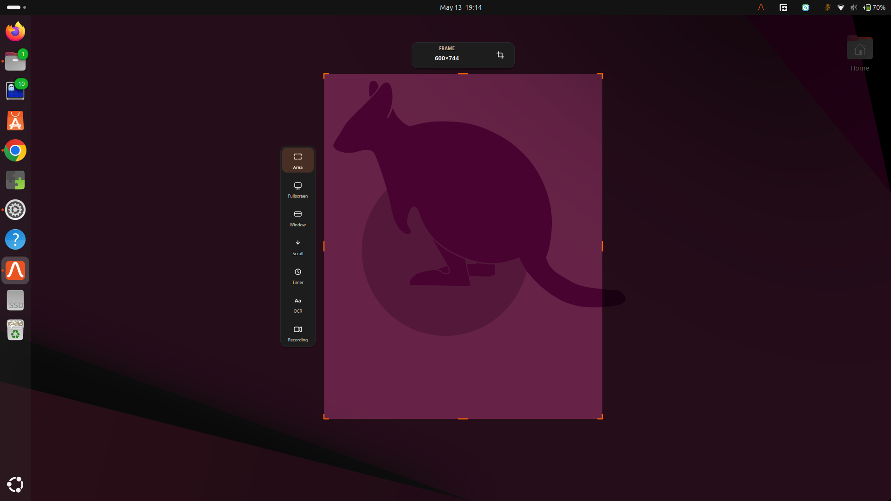
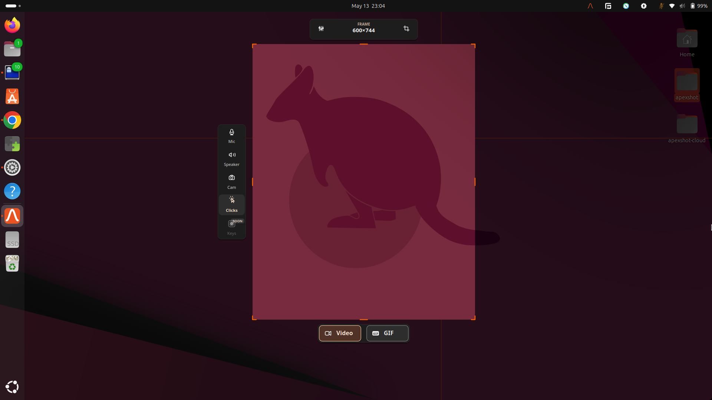
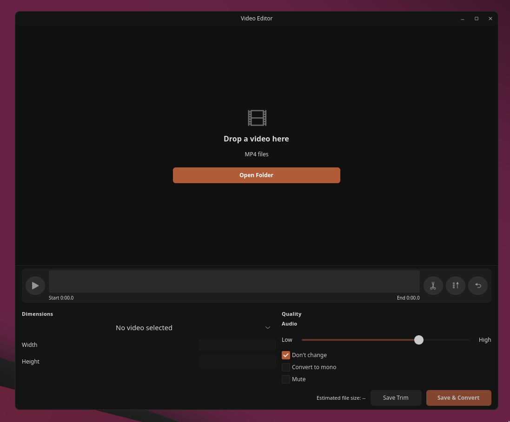
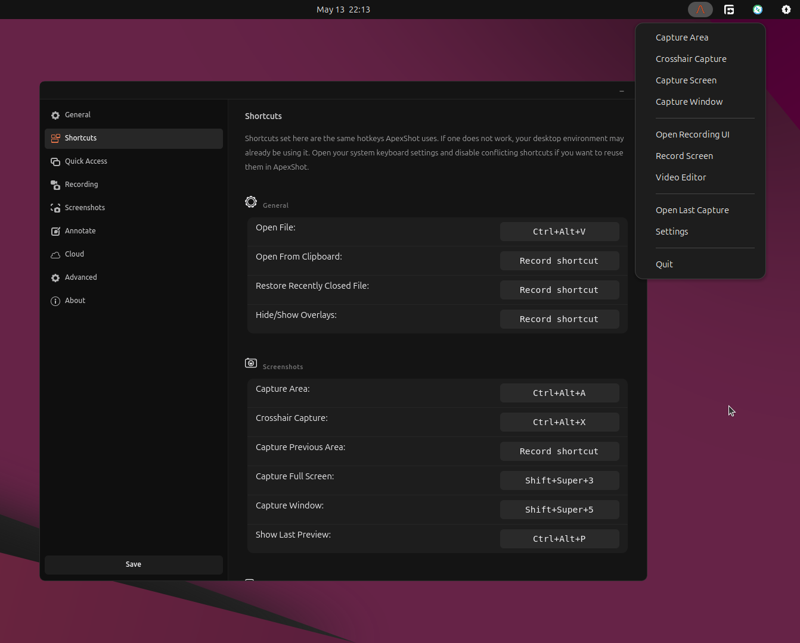

# ApexShot

**ApexShot is an open-source screenshot, annotation, and screen recording tool
for Linux.** It brings fast captures, editing, OCR, QR code detection, browser
scroll capture, hotkeys, and copy/share workflows to GNOME Wayland and other
Linux desktops.

For people searching for a ShareX alternative for Linux, ApexShot covers many
of the same capture, annotation, recording, OCR, and sharing workflows. This is
the official ApexShot GitHub repository.

ApexShot is independent and is not affiliated with ShareX, Flameshot, or
CleanShot X.



[**▶ Install in one command**](#quick-install-recommended) ·
[GitHub Repository](https://github.com/apex-shot/apexshot) ·
[Website](https://apexshot.org/) ·
[Releases](https://github.com/apex-shot/apexshot/releases) ·
[Report a bug](https://github.com/apex-shot/apexshot/issues/new/choose)


## ApexShot for Linux

ApexShot is built as its own native Linux tool, not a clone. It is useful for
Linux users who want a polished all-in-one capture workflow, and it is also a
practical ShareX alternative for Linux users who need screenshots, annotation,
screen recording, OCR, QR detection, browser scroll capture, global hotkeys, and
quick clipboard actions in one open-source app.

| Workflow | ApexShot support |
|---|---|
| ShareX-style capture | Full screen, area, window, and crosshair screenshots |
| Annotation and editing | Arrows, shapes, text, blur, pixelate, crop, highlighter, and color picker |
| Screen recording | Area or full-screen recording with MP4/GIF output, audio monitoring, and webcam PiP |
| Video editing | Trim, convert dimensions, adjust quality, and change audio mode for MP4 recordings |
| Text and code extraction | OCR plus automatic QR code detection from captured regions |
| Linux desktop integration | GNOME Wayland support, portal-backed capture paths, tray, daemon mode, and global hotkeys |
| Open-source project | GPL-3.0 source code, GitHub releases, issues, and discussions at https://github.com/apex-shot/apexshot |

## Install

ApexShot is already usable as a daily screenshot tool on GNOME Wayland. The
recommended installer detects Ubuntu/Debian vs Arch Linux, installs the right
package type, and sets up the GNOME extension when shell-level GNOME
integration is available:

```bash
curl -fsSL https://raw.githubusercontent.com/apex-shot/apexshot/main/scripts/install.sh | bash
```

Works best today on:

| Environment | Status |
|---|---|
| GNOME Shell 47-50 on Ubuntu 24.04 / 25.10 / Pop!_OS 22.04 / Arch (Wayland) | Public beta, tested daily |
| GNOME Shell 45 / 46 (Wayland) | Should work, less exercised |
| Pop!_OS 22.04 (Ubuntu-based, Wayland) | Supported via deb package |
| Hyprland / Sway / wlroots-like compositors (Wayland) | Full Rust-native stack: GTK4 layer-shell overlay for area/crosshair selection, `wlr-screencopy` for screenshots, `wf-recorder` for recording (falls back to ScreenCast + PipeWire if `wf-recorder` not installed). No Qt overlay or GNOME extension needed. |
| KDE Plasma 6 / Niri / other Wayland desktops | ScreenCast portal + PipeWire path implemented, not yet tested |
| Fedora / openSUSE / NixOS / Alpine / Gentoo / Void (Wayland) | Distro-family support metadata implemented, packaging/testing pending |
| X11 on any distro | Experimental |

If ApexShot breaks on your setup, please [open an issue](https://github.com/apex-shot/apexshot/issues/new/choose).
The issue templates ask for distro, desktop environment, and display server so
triage stays fast.

## Project Status

ApexShot is in **public beta**.

Core screenshot capture, annotation, OCR, QR detection, screen recording, tray
integration, and hotkeys are implemented. It is not a prototype or library-only
experiment; it ships as an installable desktop app.

Some advanced recording overlay features are still experimental because GNOME
Shell restricts what normal desktop apps can draw or listen to globally.
ApexShot uses a companion GNOME Shell extension for those integrations, and
support is improving over time.

## Features

### Screenshots
- **Multiple Capture Modes** — Full screen, area selection, window capture, and crosshair mode
  
  
- **Image Editor** — Annotate with arrows, shapes, text, blur, pixelate, highlighter, and more
- **OCR** — Extract text from images using Tesseract and ocrs dual-engine OCR
- **QR Code Detection** — Automatically detect and copy QR codes from screenshots

### Screen Recording
- **Flexible Recording** — Area or full-screen recording with MP4/GIF output
  
- **Audio Monitoring** — Real-time mic and speaker level monitoring via PipeWire
- **Webcam PiP** — Picture-in-picture webcam overlay during recording
- **Recording Controls** — Pause, resume, and stop recording with on-screen controls
- **Video Editor** — Trim, convert dimensions, adjust quality, and change audio mode for MP4 recordings. Open from the tray menu, CLI (`apexshot video-editor`), or a global hotkey. Supports drag-and-drop and file chooser for loading videos.
  

### Integration
- **Daemon Mode** — Background service with system tray and global hotkeys for instant capture
  
- **Dual Display Support** — Wayland (including GNOME) is fully tested; X11 implementations exist but are not yet thoroughly tested
- **Browser Integration** — Full-page scroll capture via Chrome/Chromium extension
- **GNOME Integration** — Always-on-top previews and shell-managed recording overlays
- **Smart Clipboard** — Automatic clipboard integration for quick sharing

## Tech Stack

| Layer | Technology |
|-------|-----------|
| **Core** | Rust 2021 Edition |
| **Native Overlay** | C++17 / Qt5 (region selection, drawing) |
| **GUI** | GTK4 + gtk4-layer-shell |
| **Display Servers** | X11 (x11rb + MIT-SHM), GNOME Wayland screenshots via XDG Screenshot portal + C++ overlay, wlroots/Hyprland/Sway screenshots via `wlr-screencopy` + Rust GTK layer-shell, recording via `wf-recorder` on wlroots or ScreenCast portal + PipeWire elsewhere |
| **Recording** | Native PipeWire + ffmpeg (VP9, H.264, GIF) on Wayland; GStreamer ximagesrc fallback on X11 |
| **Audio** | PipeWire/PulseAudio (mic/speaker capture via ffmpeg) |
| **OCR** | Tesseract + ocrs/rten |
| **System Tray** | ksni (KDE System Tray Integration) |
| **Webcam** | Camera portal + native PipeWire; v4l2 GStreamer fallback |

## Download

### Quick Install — Recommended

Run the interactive installer. It detects Ubuntu/Debian vs Arch Linux,
installs the right package type, and sets up the GNOME extension:

```bash
curl -fsSL https://raw.githubusercontent.com/apex-shot/apexshot/main/scripts/install.sh | bash
```

> **Tip:** The installer shows a stylish progress UI with spinners, colour-coded
> status messages, download progress, and a summary screen when finished.

### Ubuntu / Debian

The generic installer above will select this automatically. Direct command:

```bash
curl -fsSL https://raw.githubusercontent.com/apex-shot/apexshot/main/scripts/ubuntu-install.sh | bash
```

### Quick Install — Arch Linux

The generic installer above will select this automatically. Direct command:

```bash
curl -fsSL https://raw.githubusercontent.com/apex-shot/apexshot/main/scripts/arch-install.sh | bash
```

By default this installs the pre-built GitHub Release package. To choose a
different Arch install method explicitly:

```bash
curl -fsSL https://raw.githubusercontent.com/apex-shot/apexshot/main/scripts/arch-install.sh | bash -s -- --aur
curl -fsSL https://raw.githubusercontent.com/apex-shot/apexshot/main/scripts/arch-install.sh | bash -s -- --source
```

Or install manually from the AUR PKGBUILD:

```bash
git clone https://github.com/apex-shot/apexshot.git
cd apexshot/packaging/arch
makepkg -sf
sudo pacman -U *.pkg.tar.zst
```

AUR publishing notes for maintainers live in
[`docs/AUR_PUBLISHING.md`](docs/AUR_PUBLISHING.md).

> **Note:** The package installs the GNOME Shell extension system-wide.
> Restart GNOME Shell (log out and back in on Wayland) to activate it.

### Updating

The generic updater detects the distro:

```bash
curl -fsSL https://raw.githubusercontent.com/apex-shot/apexshot/main/scripts/update.sh | bash
```

Direct Ubuntu / Debian command:

```bash
curl -fsSL https://raw.githubusercontent.com/apex-shot/apexshot/main/scripts/ubuntu-update.sh | bash
```

Direct Arch Linux command:

```bash
curl -fsSL https://raw.githubusercontent.com/apex-shot/apexshot/main/scripts/arch-update.sh | bash
```

### Build from Source

```bash
git clone https://github.com/apex-shot/apexshot.git
cd apexshot
cargo build --release
```

The C++ Qt5 overlay is automatically compiled via CMake during the Rust build.

## Installation

### System Dependencies (Ubuntu/Debian)

```bash
sudo apt install \
  build-essential cmake pkg-config \
  libx11-dev libxext6 libxtst-dev \
  qtbase5-dev libqt5widgets5 libqt5x11extras5-dev \
  libgstreamer1.0-dev gstreamer1.0-plugins-base gstreamer1.0-plugins-good \
  gstreamer1.0-plugins-bad gstreamer1.0-plugins-ugly gstreamer1.0-libav \
  libpipewire-0.3-dev \
  tesseract-ocr libtesseract-dev libleptonica-dev \
  libgtk-4-dev libadwaita-1-dev libgtk4-layer-shell-dev
```

### System Dependencies (Arch Linux)

```bash
sudo pacman -S --needed \
  base-devel rust cargo git cmake clang pkgconf \
  gtk4 libadwaita gtk4-layer-shell \
  gstreamer gst-plugins-base gst-plugins-good gst-plugins-bad gst-libav gst-plugin-pipewire \
  pipewire pipewire-pulse libpipewire \
  tesseract tesseract-data-eng leptonica \
  qt5-base qt5-x11extras libxtst \
  wl-clipboard xclip libnotify xdg-utils ffmpeg grim \
  xdg-desktop-portal xdg-desktop-portal-hyprland xdg-desktop-portal-wlr
```

### First-Time Setup

After installation, ApexShot will launch an onboarding wizard to help you:

1. **GNOME Extension** (required) — Install the GNOME Shell extension for full functionality
2. **Browser Extension** (optional) — Set up Chrome/Chromium extension for full-page capture
3. **Cloud Sync** (coming soon) — Configure cloud storage for automatic backup

### Manual Install

The manual install command is for local builds. If a package-managed ApexShot
already exists in `/usr/bin`, the installer refuses to place another
`apexshot` in `/usr/local/bin` because that would shadow the `.deb` app.
Use `--dev` for a separate test install instead.

Because binaries need root but autostart lives in your home directory, run
the two parts separately:

```bash
# 1. Install binaries (requires root)
sudo apexshot install --no-autostart

# 2. Set up autostart for the CURRENT user (no sudo)
apexshot install --no-binary
```

For a local development build that can live beside the official package:

```bash
cargo build --release
sudo target/release/apexshot install --dev --no-autostart
apexshot-dev
```

Optional flags:

```bash
# Also install the browser native-messaging host (for the web-scroll extension)
sudo apexshot install --no-autostart --extension-id <chrome-extension-id>

# Force reinstall even if the same version is already present
sudo apexshot install --no-autostart --force

# Remove the separate development install
sudo apexshot-dev uninstall --dev
```

### GNOME Extension (Required)

ApexShot requires the GNOME Shell extension for full functionality on GNOME
Wayland. Without it, preview windows may not stay on top, recording masks will
not appear, and runtime overlays will not work.

This is a GNOME platform limitation, not a sign that the app is unfinished:
normal desktop apps cannot freely draw above every window or listen to every
global input event on GNOME Wayland. The extension gives ApexShot the shell-side
hooks needed for CleanShot-style recording overlays and preview behavior.

**Supported GNOME versions:** 45–50

#### Install from GitHub Release (Recommended)

```bash
# Download the GNOME extension (finds latest release that has the zip)
curl -fsSL -o apexshot-gnome-integration.zip \
  "$(curl -fsSL https://api.github.com/repos/apex-shot/apexshot/releases | grep -o '"browser_download_url": *"[^"]*apexshot-gnome-integration.zip"' | head -n 1 | cut -d '"' -f 4)"

# Install using gnome-extensions
gnome-extensions install apexshot-gnome-integration.zip
gnome-extensions enable apexshot-gnome-integration@apexshot.github.io
```

#### Install from Source

If you cloned the repository and want to install the development version:

```bash
cd gnome-extension
zip -r apexshot-gnome-integration.zip . -x "*.git*" "screenshots/*" "tests/*" "*.md"
gnome-extensions install apexshot-gnome-integration.zip
gnome-extensions enable apexshot-gnome-integration@apexshot.github.io
```

#### Install via Extension Manager (GUI)

1. Install [Extension Manager](https://flathub.org/apps/com.mattjakeman.ExtensionManager) from Flathub
2. Click **Browse** and search for "ApexShot"
3. Install and enable the extension

> **Note:** The extension may not yet be published on extensions.gnome.org. Use the release zip or source methods above until it is available.

#### Verify Installation

```bash
# Check that the extension is installed and enabled
gnome-extensions list
gnome-extensions info apexshot-gnome-integration@apexshot.github.io

# Check GNOME Shell logs for ApexShot activity
journalctl /usr/bin/gnome-shell -f | grep apexshot
```

#### What the Extension Provides

- **Always-on-top preview windows** — Screenshot previews and annotation editor windows stay above other applications during drag operations
- **Shell-managed recording masks** — A dimmed fullscreen mask highlights the selected recording area
- **Window tracking** — D-Bus signals keep preview windows stacked correctly when switching apps

**Note:** The runtime click-overlay and keystroke-overlay features have been removed.

#### Troubleshooting

| Issue | Solution |
|---|---|
| Preview windows get hidden behind other apps | Verify extension is enabled: `gnome-extensions list` |
| Recording mask does not appear | Check logs: `journalctl /usr/bin/gnome-shell -f | grep apexshot` |
| Extension fails to enable | Confirm GNOME Shell version is 45–50 and matches `metadata.json` |
| D-Bus signals not working | Monitor session bus: `dbus-monitor --session | grep apexshot` |

**Known Limitations:**
- Capture overlay is tied to the window where it was initiated. Moving to another application window will hide the overlay until you return to the original window.

**Note:** The onboarding wizard will automatically guide you through installing the GNOME extension on first launch.

## Usage

### Default Behavior (Deb Package)

The deb package installs ApexShot as a background daemon with system tray icon and global hotkeys by default. It starts automatically on login.

### Manual Daemon Mode

If you built from source or want to run the daemon manually:

```bash
apexshot daemon
```

### CLI Commands

```bash
# Screenshots
apexshot capture screen          # Full screen capture
apexshot capture area            # Area selection capture
apexshot capture window          # Window capture

# Recording
apexshot record screen           # Full screen recording
apexshot record area --gif       # Area recording as GIF

# OCR (requires image path)
apexshot ocr <image-path>        # Extract text from image

# Editor (requires image path)
apexshot edit <image-path>       # Open image in annotation editor

# Video Editor
apexshot video-editor            # Open video editor (with optional MP4 path)
apexshot video-editor <video>    # Open video editor with a specific video

# Settings
apexshot settings                # Open settings window
```

### Recording on non-GNOME systems (Hyprland, Sway, KDE, X11)

ApexShot uses a fully self-contained Rust stack for recording on systems
without GNOME Shell. No Qt overlay, no shell extension — the daemon, the GTK4
overlay, and native PipeWire handle everything.

**How it works:**
1. The daemon runs in the background with a system tray icon and global hotkeys.
2. Triggering a recording action (`apexshot record area`, tray click, or hotkey)
   opens the Rust GTK4 overlay for area selection and recording configuration.
3. The overlay provides the same controls as the GNOME path: mic/speaker toggles,
   webcam PiP, format picker (MP4/GIF), countdown, and video quality settings.
4. Once confirmed, recording begins. On wlroots compositors (Hyprland/Sway),
   `wf-recorder` is preferred when installed for native `wlr-screencopy`
   capture. On other Wayland compositors, native PipeWire capture
   (`src/pipewire_engine.rs`) grabs frames via the XDG ScreenCast portal,
   and ffmpeg encodes them to the chosen format. On X11, a GStreamer
   `ximagesrc` pipeline is used as fallback.
5. During recording, a floating GTK4 stop overlay shows pause/stop controls
   and elapsed time. Pause/resume/stop can also be triggered from the tray menu
   or global hotkeys.

**What you get without GNOME:**
- Full screen and area recording (MP4, WebM, GIF)
- Mic and speaker audio capture with level monitoring
- Webcam picture-in-picture overlay
- Countdown timer before recording starts
- Pause/resume/restart/stop during recording
- Post-recording video editor (trim, resize, re-encode)
- System tray with quick-access actions
- Global hotkeys configurable in Settings

```bash
# Start the daemon (launches tray icon + hotkey listener)
apexshot daemon

# Record directly from CLI without the daemon
apexshot record screen              # Full screen recording
apexshot record area --gif          # Area recording as GIF
apexshot record area --format mp4   # Area recording as MP4
```

### Keyboard Shortcuts

Configure global hotkeys in Settings > Shortcuts. The daemon supports:

- **Capture shortcuts** — Full screen, area, window, last capture
- **Recording shortcuts** — Start/stop/pause recording
- **Custom shortcuts** — Record and assign any key combination per action

## Project Structure

```
apexshot/
├── src/                    # Rust core (capture, editor, recording, settings, daemon)
│   ├── capture/            # Screen capture logic
│   │   └── editor/         # Image annotation editor
│   ├── backend/            # Display backend abstraction (X11, Wayland)
│   ├── recording/          # Screen recording with native PipeWire + ffmpeg
│   ├── settings/           # Settings UI and management
│   ├── onboarding/         # First-time setup wizard
│   ├── gnome_integration/  # GNOME Shell integration
│   ├── qr/                 # QR code detection
│   ├── pipewire_engine.rs  # Native PipeWire screen capture engine
│   └── lib.rs              # Library exports
├── capture-overlay/        # C++ Qt5 native overlay (region selection, drawing)
├── gnome-extension/        # GNOME Shell extension (preview windows, recording mask)
├── web-scroll-extension/   # Chrome/Chromium extension (full-page scroll capture)
├── native-host/            # Native messaging host for browser integration
├── packaging/              # Package assets (desktop files, icons, deb helper)
├── tests/                  # Integration tests
├── docs/                   # Architecture, data flow, and implementation docs
├── build.rs                # Build script (CMake C++ overlay + icon bundling)
└── Cargo.toml              # Rust dependencies and package metadata
```

## Development

### Building

```bash
cargo build --release
```

### Testing

```bash
cargo test
```

### Building Debian Package

```bash
cargo deb
```

The package will be created in `target/debian/`.

### Running from Source

```bash
cargo run -- daemon
```

### Code Style

- Use `cargo fmt` for formatting
- Use `cargo clippy` for linting
- Follow Rust best practices and idioms

## Contributing

ApexShot especially needs testers across Linux desktop environments. Helpful
contributions include:

- Testing the installer on Ubuntu/Debian and Arch-based systems
- Testing Wayland behavior on KDE Plasma, Sway, Hyprland, and other compositors
- Improving packaging for additional distros
- Reporting GNOME extension issues with shell logs attached
- Improving docs, screenshots, release notes, and troubleshooting steps

If you want to contribute code, start with an issue that includes your distro,
desktop environment, display server, and the workflow you want to improve.

## License

GPL-3.0 — See [LICENSE](LICENSE) for details.
