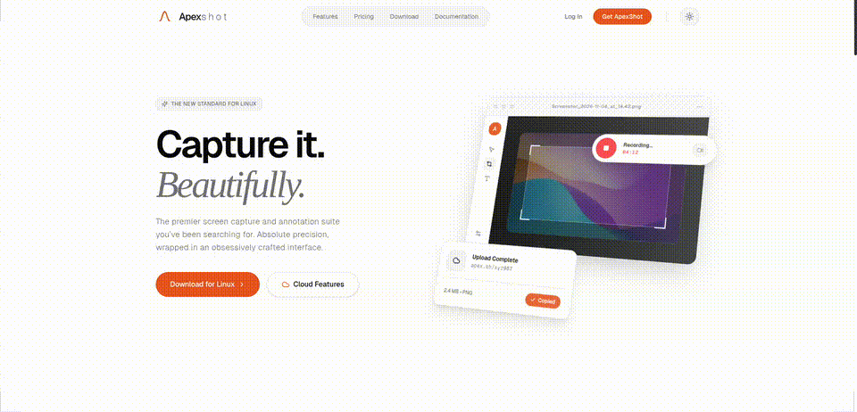

# ApexShot

An open-source Linux screen capture tool with annotation, recording, and OCR.

**Website:** https://apexshot.org/

> **Note:** Currently tested on GNOME Ubuntu (Wayland). X11 implementations exist in the codebase but have not been thoroughly tested. Support for other distributions and desktop environments will be expanded as the project grows.




## Features

### Screenshots
- **Multiple Capture Modes** — Full screen, area selection, window capture, and crosshair mode
- **Image Editor** — Annotate with arrows, shapes, text, blur, pixelate, highlighter, and more
- **OCR** — Extract text from images using Tesseract and ocrs dual-engine OCR
- **QR Code Detection** — Automatically detect and copy QR codes from screenshots

### Screen Recording
- **Flexible Recording** — Area or full-screen recording with MP4/GIF output
- **Audio Monitoring** — Real-time mic and speaker level monitoring via PipeWire
- **Webcam PiP** — Picture-in-picture webcam overlay during recording
- **Recording Controls** — Pause, resume, and stop recording with on-screen controls
- **Runtime Click Overlay** — On-screen click animations during recording, rendered by the GNOME extension and visually matched to the configuration preview (filled or outlined marker, soft halo, optional expanding pulse ring)
- **Keystroke Overlay** — *Temporarily disabled.* The keystroke tile in the recording UI is shown as a non-interactive "SOON" badge; the underlying recorder hook is still being implemented and will be re-enabled in a future release

### Integration
- **Daemon Mode** — Background service with system tray and global hotkeys for instant capture
- **Dual Display Support** — Wayland (including GNOME) is fully tested; X11 implementations exist but are not yet thoroughly tested
- **Browser Integration** — Full-page scroll capture via Chrome/Chromium extension
- **GNOME Integration** — Always-on-top previews and shell-managed recording overlays
- **Smart Clipboard** — Automatic clipboard integration for quick sharing

## Tech Stack

| Layer | Technology |
|-------|-----------|
| **Core** | Rust 2021 Edition |
| **Native Overlay** | C++17 / Qt5 (region selection, drawing) |
| **GUI** | GTK4 + gtk4-layer-shell |
| **Display Servers** | X11 (x11rb + MIT-SHM), Wayland (ashpd + wlr-screencopy) |
| **Recording** | GStreamer (VP8, VP9, H.264, H.265, Theora, GIF) |
| **Audio** | PipeWire (mic/speaker level monitoring) |
| **OCR** | Tesseract + ocrs/rten |
| **System Tray** | ksni (KDE System Tray Integration) |
| **Webcam** | GStreamer + v4l2 |

## Download

### Debian/Ubuntu (.deb)

Download and install the latest `.deb` package from GitHub Releases:

```bash
# Download and install the latest release
curl -fsSL -o apexshot_latest.deb \
  "$(curl -fsSL https://api.github.com/repos/apex-shot/apexshot/releases/latest | grep "browser_download_url.*amd64.deb" | cut -d '"' -f 4)" \
  && sudo dpkg -i apexshot_latest.deb \
  && sudo apt install -f
```

Or manually download from [GitHub Releases](https://github.com/apex-shot/apexshot/releases):

```bash
# Install the downloaded package
sudo dpkg -i apexshot_*.deb
sudo apt install -f  # Install any missing dependencies
```

### Updating

The same install command works for updates — `dpkg -i` performs an in-place
upgrade, preserving your settings and configuration. No need to uninstall first:

```bash
curl -fsSL -o apexshot_latest.deb \
  "$(curl -fsSL https://api.github.com/repos/apex-shot/apexshot/releases/latest | grep "browser_download_url.*amd64.deb" | cut -d '"' -f 4)" \
  && sudo dpkg -i apexshot_latest.deb \
  && sudo apt install -f
```

### Build from Source

```bash
git clone https://github.com/apex-shot/apexshot.git
cd apexshot
cargo build --release
```

The C++ Qt5 overlay is automatically compiled via CMake during the Rust build.

## Installation

### System Dependencies (Ubuntu/Debian)

```bash
sudo apt install \
  build-essential cmake pkg-config \
  libx11-dev libxext6 libxtst-dev \
  qtbase5-dev libqt5widgets5 libqt5x11extras5-dev libqt5network5-dev libqt5dbus5-dev \
  libgstreamer1.0-dev gstreamer1.0-plugins-base gstreamer1.0-plugins-good \
  gstreamer1.0-plugins-bad gstreamer1.0-plugins-ugly gstreamer1.0-libav \
  libpipewire-0.3-dev \
  tesseract-ocr \
  libgtk-4-dev libadwaita-1-dev libgtk4-layer-shell-dev
```

### First-Time Setup

After installation, ApexShot will launch an onboarding wizard to help you:

1. **GNOME Extension** (required) — Install the GNOME Shell extension for full functionality
2. **Browser Extension** (optional) — Set up Chrome/Chromium extension for full-page capture
3. **Cloud Sync** (coming soon) — Configure cloud storage for automatic backup

### Manual Install

```bash
sudo apexshot install                          # Binary + autostart
sudo apexshot install --extension-id <id>      # + browser native messaging host
sudo apexshot install --force                  # Reinstall even if same version
```

`apexshot install` is not the same as installing/upgrading the `.deb`.
It copies `apexshot` and `apexshot-capture` into `/usr/local/bin`, which can
shadow the package-managed binaries in `/usr/bin`. To upgrade an existing `.deb`
installation in place, use the `.deb` update flow above with `dpkg -i`.

### GNOME Extension (Required)

ApexShot requires the GNOME Shell extension for full functionality on GNOME Wayland. Without it, preview windows may not stay on top, recording masks will not appear, and runtime overlays will not work.

**Supported GNOME versions:** 45–49

#### Install from GitHub Release (Recommended)

```bash
# Download the GNOME extension (finds latest release that has the zip)
curl -fsSL -o apexshot-gnome-integration.zip \
  "$(curl -fsSL https://api.github.com/repos/apex-shot/apexshot/releases | grep -o '"browser_download_url": *"[^"]*apexshot-gnome-integration.zip"' | head -n 1 | cut -d '"' -f 4)"

# Install using gnome-extensions
gnome-extensions install apexshot-gnome-integration.zip
gnome-extensions enable apexshot-gnome-integration@apexshot.github.io
```

#### Install from Source

If you cloned the repository and want to install the development version:

```bash
cd gnome-extension
zip -r apexshot-gnome-integration.zip . -x "*.git*" "screenshots/*" "tests/*" "*.md"
gnome-extensions install apexshot-gnome-integration.zip
gnome-extensions enable apexshot-gnome-integration@apexshot.github.io
```

#### Install via Extension Manager (GUI)

1. Install [Extension Manager](https://flathub.org/apps/com.mattjakeman.ExtensionManager) from Flathub
2. Click **Browse** and search for "ApexShot"
3. Install and enable the extension

> **Note:** The extension may not yet be published on extensions.gnome.org. Use the release zip or source methods above until it is available.

#### Verify Installation

```bash
# Check that the extension is installed and enabled
gnome-extensions list
gnome-extensions info apexshot-gnome-integration@apexshot.github.io

# Check GNOME Shell logs for ApexShot activity
journalctl /usr/bin/gnome-shell -f | grep apexshot
```

#### What the Extension Provides

- **Always-on-top preview windows** — Screenshot previews and annotation editor windows stay above other applications during drag operations
- **Shell-managed recording masks** — A dimmed fullscreen mask highlights the selected recording area
- **Runtime click overlays** — Click animations rendered directly on the GNOME Shell stage. Each click draws a soft coloured halo, a filled or outlined marker (your choice in *Click Highlights*), and an optional expanding pulse ring when *Animate clicks* is enabled — identical visual treatment to the configuration preview, so what you see while configuring is what you record
- **Keystroke overlay (currently disabled)** — The visual scaffolding is in place but the recorder side is not yet wired up; see *Known Limitations* below
- **Window tracking** — D-Bus signals keep preview windows stacked correctly when switching apps

#### Troubleshooting

| Issue | Solution |
|---|---|
| Preview windows get hidden behind other apps | Verify extension is enabled: `gnome-extensions list` |
| Recording mask does not appear | Check logs: `journalctl /usr/bin/gnome-shell -f \| grep apexshot` |
| Extension fails to enable | Confirm GNOME Shell version is 45–49 and matches `metadata.json` |
| D-Bus signals not working | Monitor session bus: `dbus-monitor --session \| grep apexshot` |

**Known Limitations:**
- **Keystroke overlay is intentionally disabled in the current release.** The "Show keystrokes" tile in the recording UI is greyed out with a `SOON` badge; the configuration row in the recording settings is also disabled. Click handling for the tile is short-circuited so toggling it has no effect, and `recordKeystrokesEnabled()` is force-clamped to `false` so a stale persisted setting can't reach the recorder. The feature will return once the recorder-side keystroke pipeline is implemented; tracked behind the `apexshot::kKeystrokesFeatureAvailable` flag in `capture-overlay/src/CaptureOverlay.h`.
- Capture overlay is tied to the window where it was initiated. Moving to another application window will hide the overlay until you return to the original window.

**Note:** The onboarding wizard will automatically guide you through installing the GNOME extension on first launch.

## Usage

### Default Behavior (Deb Package)

The deb package installs ApexShot as a background daemon with system tray icon and global hotkeys by default. It starts automatically on login.

### Manual Daemon Mode

If you built from source or want to run the daemon manually:

```bash
apexshot daemon
```

### CLI Commands

```bash
# Screenshots
apexshot capture screen          # Full screen capture
apexshot capture area            # Area selection capture
apexshot capture window          # Window capture

# Recording
apexshot record screen           # Full screen recording
apexshot record area --gif       # Area recording as GIF

# OCR (requires image path)
apexshot ocr <image-path>        # Extract text from image

# Editor (requires image path)
apexshot edit <image-path>       # Open image in annotation editor

# Settings
apexshot settings                # Open settings window
```

### Keyboard Shortcuts

Configure global hotkeys in Settings > Shortcuts. The daemon supports:

- **Capture shortcuts** — Full screen, area, window, last capture
- **Recording shortcuts** — Start/stop/pause recording
- **Custom shortcuts** — Record and assign any key combination per action

## Project Structure

```
apexshot/
├── src/                    # Rust core (capture, editor, recording, settings, daemon)
│   ├── capture/            # Screen capture logic
│   │   └── editor/         # Image annotation editor
│   ├── backend/            # Display backend abstraction (X11, Wayland)
│   ├── recording/          # Screen recording with GStreamer
│   ├── settings/           # Settings UI and management
│   ├── onboarding/         # First-time setup wizard
│   ├── gnome_integration/  # GNOME Shell integration
│   ├── qr/                 # QR code detection
│   ├── capture_overlay.rs  # C++ Qt5 overlay launcher
│   └── lib.rs              # Library exports
├── capture-overlay/        # C++ Qt5 native overlay (region selection, drawing)
├── gnome-extension/        # GNOME Shell extension (preview windows, recording mask)
├── web-scroll-extension/   # Chrome/Chromium extension (full-page scroll capture)
├── native-host/            # Native messaging host for browser integration
├── packaging/              # Package assets (desktop files, icons, deb helper)
├── tests/                  # Integration tests
├── docs/                   # Architecture, data flow, and implementation docs
├── build.rs                # Build script (CMake C++ overlay + icon bundling)
└── Cargo.toml              # Rust dependencies and package metadata
```

## Development

### Building

```bash
cargo build --release
```

### Testing

```bash
cargo test
```

### Building Debian Package

```bash
cargo deb
```

The package will be created in `target/debian/`.

### Running from Source

```bash
cargo run -- daemon
```

### Code Style

- Use `cargo fmt` for formatting
- Use `cargo clippy` for linting
- Follow Rust best practices and idioms

## Contributing

We welcome contributions! Please see [CONTRIBUTING.md](CONTRIBUTING.md) for guidelines.

## License

GPL-3.0 — See [LICENSE](LICENSE) for details.
