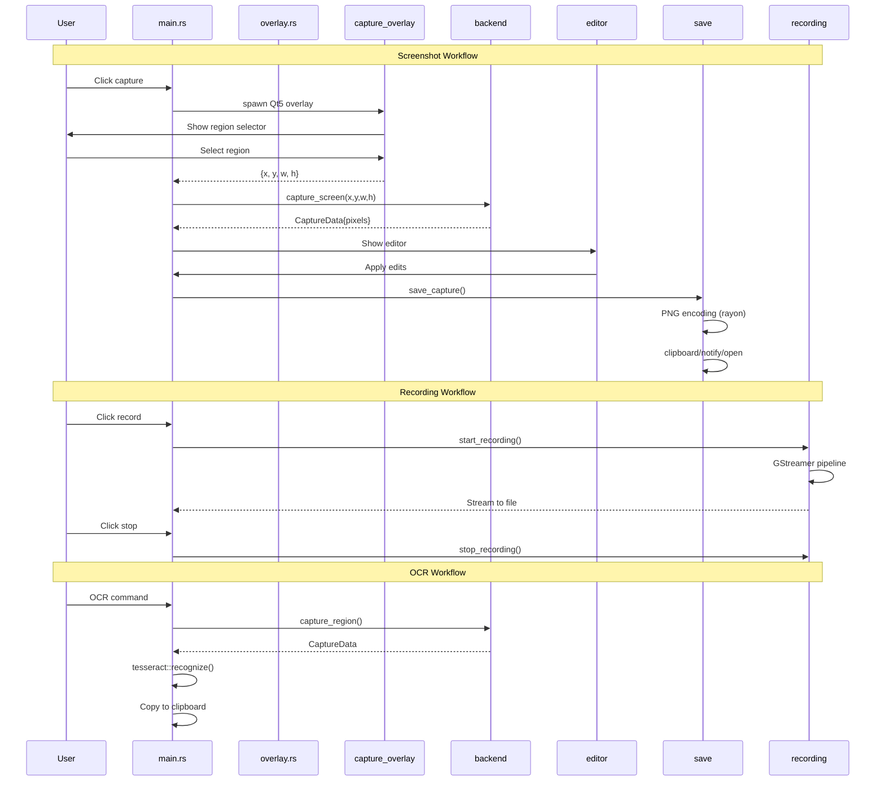
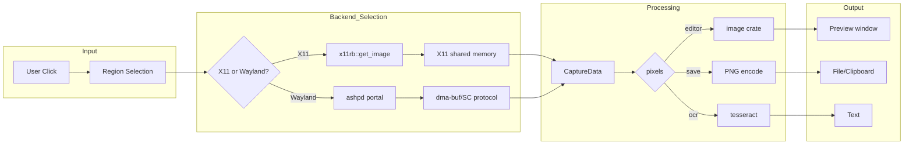
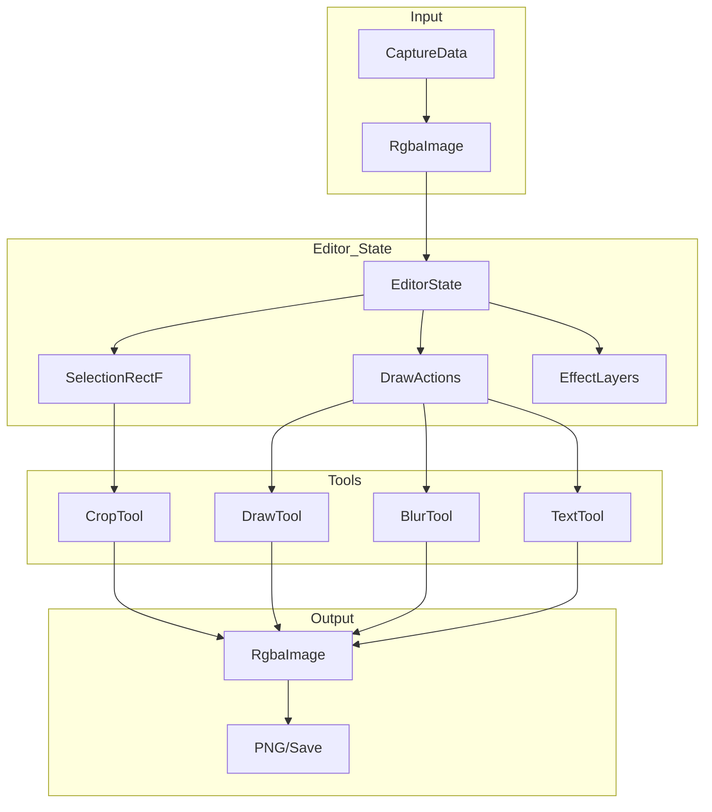

# Data Flow

## High-Level Data Paths



## Capture Pipeline Detail



## Cross-Process Communication (Rust ↔ Qt5)

### Finding the Binary

```rust
// Priority order in capture_overlay.rs:
1. APEXSHOT_CAPTURE_BIN env variable      // Manual override
2. Same directory as running exe          // Installed bundles  
3. Build-time OUT_DIR (build.rs)          // cargo build
4. target/{debug,release}/                // cargo run
5. PATH                                    // System lookup
```

### IPC Protocol

```rust
// stdin: Qt5 app runs with stdin=null (no input)
// stdout: JSON responses
// stderr: Qt logging (inherited)

// Exit codes:
0 = Success (region selected or captured)
1 = Cancelled (user pressed Escape)
2 = Error (no display, permission denied, etc.)
```

### Example Session

```bash
# Rust spawns:
Command::new("apexshot-capture")
    .env("QT_IM_MODULE", "compose")
    .stdin(Stdio::null())
    .stdout(Stdio::piped())
    .stderr(Stdio::inherit())
    .arg("--mode").arg("overlay")
    .arg("--display").arg(":0")

# Qt5 returns:
{"action":"region_selected","region":{"x":100,"y":200,"width":800,"height":600}}

# Or for fullscreen capture:
{"action":"captured","path":"/tmp/apexshot_XXXX.png","width":1920,"height":1080}
```

## Memory Management

| Stage | Type | Manager | Notes |
|-------|------|---------|-------|
| **X11 Framebuffer** | X11 shm | X server | Shared memory segment |
| **Wayland Buffer** | dmabuf | Compositor | File descriptor passing |
| **CaptureData** | `Vec<u8>` | Rust allocator | Owned pixels |
| **Image Processing** | `image::RgbaImage` | image crate | Stack-allocated for small |
| **GStreamer** | GstBuffer | C library | Refcounted |
| **OCR** | `Vec<u8>` + FFI | tesseract-rs | C++ allocation |
| **File Output** | `Vec<u8>` | rayon parallel | Parallel PNG encoding |

## Backend Abstraction

```rust
// Two implementations, one trait interface
pub trait DisplayBackend {
    fn capture_screen(&self, area: Rect) -> DisplayResult<CaptureData>;
    fn capture_area(&self, x: i32, y: i32, w: u32, h: u32) -> DisplayResult<CaptureData>;
    fn supported_formats(&self) -> &[PixelFormat];
}

// X11: Direct framebuffer access
pub struct X11Backend { /* x11rb::Connection */ }

// Wayland: Portal-based capture
pub struct WaylandBackend { /* wayland + ashpd proxies */ }
```

## Editor Data Flow



## Key Serialization Points

| From | To | Format |
|------|-----|--------|
| Config file | AppConfig | YAML |
| CLI args | SaveConfig | JSON (internal) |
| Qt5 stdout | SelectionResult | JSON |
| Editor state | File | PNG (embedded metadata) |
| OCR result | Clipboard | Plain text |

---

*Related: [Architecture.md](Architecture.md) | [Linux_Interactions.md](Linux_Interactions.md)*
