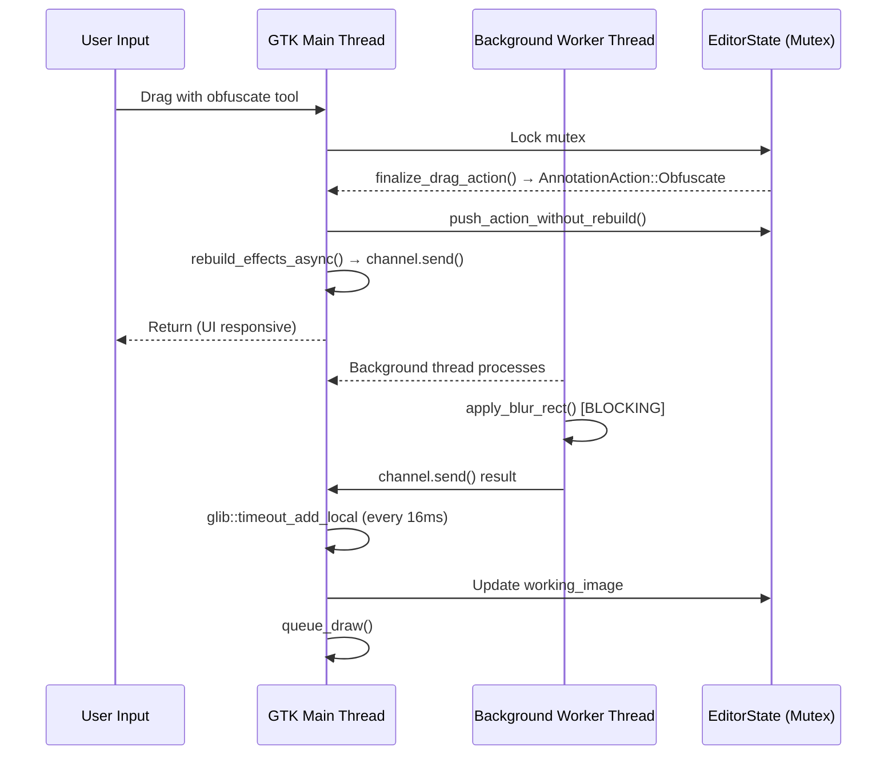

# Implementation Details

## Editor Pipeline (Critical for Debugging)

The editor uses a specific async pipeline that can cause hangs if not understood:



### Key Components

| Component | Location | Thread | Notes |
|-----------|----------|--------|-------|
| `EditorState` | `state.rs` | Main thread only | Protected by `Arc<Mutex<>>` |
| `rebuild_effects_async` | `window/mod.rs:332` | Main thread | Sends to background thread |
| Background worker | `window/mod.rs:318` | `std::thread::spawn` | Single thread for effects |
| Effects receiver | `window/mod.rs:300` | Main thread via `glib::timeout_add_local` | Polls every 16ms |

## Common Hang/Freeze Scenarios

### 1. Obfuscate Tool Not Responding

**Symptoms:**
- Click obfuscate tool → OK
- Try to draw → "Not responding" 
- Force quit or wait long time
- No drawing seen on screenshot
- Slider stays at starting point

**Likely Cause:** The background worker thread is blocked or the result isn't being received.

**Debug Steps:**
1. Check if `request_sender.send()` is being called (line 341 in `mod.rs`)
2. Check if background thread is running (line 318)
3. Check if `effects_receiver` is being processed (line 301)
4. Check if `apply_blur_rect` is slow (render.rs:609)

### 2. Slider Value Not Updating

**Symptoms:**
- Select obfuscate tool
- Slider stays at default value
- Changing slider has no effect

**Likely Cause:** `sync_size_control()` not being called or state mismatch.

**Debug Code Path:**
```
obfuscate_btn.connect_clicked (events.rs:452)
  └─> sync_size_control_obfuscate() (line 458)
        └─> apply_size_control_ui_state() (color_picker.rs:48)
              └─> state.active_size_value() (state.rs:493)
                    └─> state.obfuscate_amount (line 519)
```

**Check:**
- Is `state.obfuscate_amount` initialized? (default: `DEFAULT_OBFUSCATE_AMOUNT`)
- Is `active_size_control_mode()` returning `Some(SizeControlMode::Obfuscate)`?

## Key State Management

### EditorState Fields

```rust
pub struct EditorState {
    // Tool selection
    pub selected_tool: Tool,
    
    // Obfuscate-specific
    pub obfuscate_amount: f64,           // Default: DEFAULT_OBFUSCATE_AMOUNT
    pub selected_obfuscate_action_amount: Option<f64>,
    
    // Actions pipeline
    pub actions: Vec<AnnotationAction>,  // Applied annotations
    pub pending_effect_revision: u64,     // Increment to trigger rebuild
    
    // Working image (rendered result)
    pub working_image: RgbaImage,
    pub working_image_revision: u64,
    
    // Drawing state
    pub drag_start: Option<Point>,
    pub drag_current: Option<Point>,
    pub drag_path: Vec<Point>,           // For pen/highlighter
}
```

### Important Methods

| Method | Purpose | Thread Safety |
|--------|---------|---------------|
| `push_action_without_rebuild()` | Add annotation, don't rebuild yet | Must hold mutex |
| `rebuild_effects_async()` | Send to background thread | Main thread |
| `apply_effect_actions()` | Apply blur/pixelate to image | Background thread |
| `active_size_value()` | Get current slider value | Must hold mutex |

## Threading Constraints

### GTK Requirements
- **ALL** GTK operations must happen on the main thread
- Cannot call GTK from background threads
- Use `glib::timeout_add_local` for periodic main-thread tasks

### Mutex Rules
```rust
// CORRECT: Lock, use, then drop
{
    let st = state.lock().unwrap();
    st.push_action(action);
} // Mutex released here

// WRONG: Holding mutex across await/closure boundary
let st = state.lock().unwrap();
tokio::spawn(async move {
    st.push_action(action);  // BUG: Mutex held across async await!
});
```

## Key Function Signatures

### Effects Pipeline

```rust
// window/mod.rs:318 - Background worker
std::thread::spawn(move || {
    while let Ok(mut request) = request_receiver.recv() {
        // Drain channel to get latest
        while let Ok(newer) = request_receiver.try_recv() {
            request = newer;
        }
        
        let (base_image, actions, revision) = request;
        let mut working_image = base_image;
        
        // EXPENSIVE: This blocks the worker thread
        apply_effect_actions(&mut working_image, &actions);
        
        let _ = effects_sender.send((working_image, revision));
    }
});

// window/mod.rs:300 - Main thread receiver
glib::timeout_add_local(Duration::from_millis(16), move || {
    while let Ok((new_image, revision)) = effects_receiver.try_recv() {
        let mut st = state_effects.lock().unwrap();
        if revision > st.working_image_revision {
            st.working_image = new_image;
            st.working_image_revision = revision;
            // ... queue redraw
        }
    }
    glib::ControlFlow::Continue
});
```

### Obfuscate Flow

```rust
// events.rs:926-929 - Drag end handler
} else if let Some(action) = st.finalize_drag_action() {
    if matches!(action, AnnotationAction::Obfuscate { .. } | AnnotationAction::Focus { .. }) {
        st.push_action_without_rebuild(action);  // Add to actions list
        rebuild_effects_async_drag_end();        // Trigger background rebuild
    }
}

// state.rs:1274-1278 - Create obfuscate action
Tool::Obfuscate => Rect::from_points(start, end).map(|rect| {
    AnnotationAction::Obfuscate {
        rect,
        method: ObfuscateMethod::Blur,
        amount: self.obfuscate_amount,  // Uses current slider value
    }
}),
```

## Debugging Tips

### Adding Debug Output

```rust
// In rebuild_effects_async closure
let rebuild_effects_async = Rc::new({
    let state = state.clone();
    let sender = request_sender;
    move || {
        let (base_image, actions, revision) = {
            let mut st = state.lock().unwrap();
            eprintln!("[DEBUG] rebuild_effects_async: {} actions, rev={}", 
                     actions.len(), st.pending_effect_revision);
            st.pending_effect_revision += 1;
            (st.base_image.clone(), st.actions.clone(), st.pending_effect_revision)
        };
        let _ = sender.send((base_image, actions, revision));
    }
});
```

### Checking Worker Thread

```rust
// Add to background worker
std::thread::spawn(move || {
    eprintln!("[DEBUG] Background worker started");
    while let Ok(mut request) = request_receiver.recv() {
        // ...
        eprintln!("[DEBUG] Processing request rev={}", revision);
        // ...
    }
    eprintln!("[DEBUG] Background worker exited");
});
```

### Checking Effects Receiver

```rust
// In glib::timeout_add_local callback
glib::timeout_add_local(Duration::from_millis(16), move || {
    let received = effects_receiver.try_recv();
    match received {
        Ok((_, rev)) => eprintln!("[DEBUG] Received effect rev={}", rev),
        Err(TryRecvError::Empty) => {}  // Normal
        Err(TryRecvError::Disconnected) => eprintln!("[DEBUG] Worker disconnected!"),
    }
    // ... rest of code
});
```

## Performance Notes

### apply_blur_rect Complexity

```rust
// render.rs:609
pub fn apply_blur_rect(image: &mut RgbaImage, rect: Rect, radius: f64) {
    // Complexity: O(width * height * radius)
    // For 1920x1080 screenshot with radius=30:
    // ~62M operations per blur
    
    // Optimization: Uses separable box blur for O(width*height)
    // Still expensive for large regions
}
```

### Why the Slider Might Not Update

1. **State not synced**: `obfuscate_amount` may be default (10.0)
2. **Slider not connected**: Check `size_slider.connect_value_changed()`
3. **CSS hiding slider**: Check `.size-group-inactive` CSS class

---

*Related: [Architecture.md](Architecture.md) | [Data_Flow.md](Data_Flow.md)*
