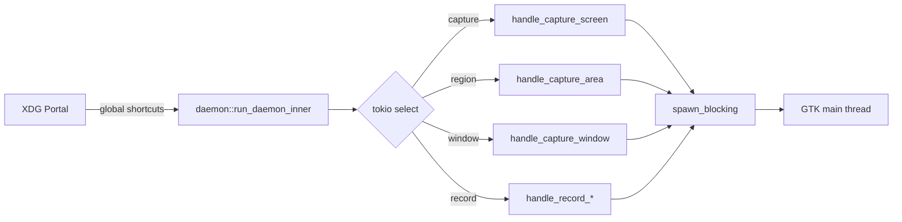

# Linux Interactions

## Display Server Support Matrix

| Feature | X11 | Wayland | Library |
|---------|-----|---------|---------|
| **Screen Capture** | ✓ Direct | Portal only | x11rb / ashpd |
| **Region Selection** | ✓ Qt5 overlay | ✓ Qt5 overlay | Qt5 + X11 |
| **Window Capture** | ✓ X11 windows | ✓ Portal | x11rb / ashpd |
| **Global Hotkeys** | ✓ XGrabKey | Portal shortcuts | x11rb / zbus |
| **Cursor Capture** | ✓ XFixes | Portal | x11rb / ashpd |
| **Overlay Window** | ✓ Layer shell | ✓ Layer shell | gtk4-layer-shell |
| **System Tray** | ✓ | ✓ | ksni |
| **Clipboard** | ✓ | ✓ | arboard |

## X11 Backend (x11rb)

### Direct Framebuffer Access

```rust
// src/backend/x11.rs
let conn = x11rb::connect(None)?;

// Get root window
let screen = &conn.setup().roots[0];
let root = screen.root;

// Capture via XGetImage or MIT-SHM (shared memory)
let image = conn.get_image(
    x11rb::COPY_FROM_ROOT,
    x, y, width, height,
    AllPlanes as u64,
    ZPixmap
)?;

// Or faster: shared memory extension
let shm_seg = conn.shm_create_segment(
    size as u32,
    true  // read-only
)?;
conn.shm_get_image(root, x, y, width, height, AllPlanes, ZPixmap, shm_seg, 0)?;
```

### X11 Extensions Used

| Extension | Purpose |
|-----------|---------|
| XTEST | Simulate key presses for scroll injection |
| XFIXES | Cursor position and shape |
| XSHM | Fast shared memory capture |
| XDamage | (Optional) Detect screen changes |
| XDBE | Double buffering |

### Global Hotkeys (X11)

```rust
// Register global shortcut
conn.grab_key(
    false,
    root,
    ModMask::CONTROL | ModMask::SHIFT,
    keycode,
    GrabMode::Async,
    GrabMode::Async
)?;
```

## Wayland Backend (ashpd + wayland-client)

### Portal-Based Capture

```rust
// src/backend/wayland.rs (via ashpd)
use ashpd::desktop::screencast::{Screencast, SourceType, CursorMode};

async fn capture_wayland() -> Result<Stream> {
    let proxy = Screencast::new()?;
    
    let streams = proxy.start(
        SourceType::Monitor,  // or Window
        CursorMode::Embedded,
        true,  // persist
    ).await?;
    
    // Stream provides dmabuf file descriptors
    // or shared memory buffers
}
```

### Portal Communication (DBus)

```rust
// ashpd uses zbus internally
// XDG Desktop Portal (xdg-desktop-portal)
// Service: org.freedesktop.portal.Desktop
// Object: /org/freedesktop/portal/desktop

// Methods:
// - CreateSession() → session_handle
// - SelectSources() → sources[]
// - Start() → stream fd
```

### Fallback: wlr-screencopy

For compositors supporting wlr-screencopy-unstable-v1:

```rust
// src/backend/screencopy.rs
// Uses wayland-client directly
// Protocol: zwlr_screencopy_manager_v1
```

## Input Simulation

### X11 (XTest)

```rust
// Scroll injection for web scrolling capture
conn.xtest().fake_input(
    ButtonPress,
    Button4,
    0
)?;
conn.xtest().fake_input(
    ButtonRelease, 
    Button4,
    0
)?;
```

### Wayland

No reliable XTest equivalent — requires compositor support or keyboard daemon.

## System Tray

```rust
// src/tray/mod.rs
// Uses ksni (KDE System Tray Integration)
// Works on: GNOME, KDE, XFCE, etc.

pub struct ApexShotTray {
    // ksni tray item
}

// Menu actions:
// - Take Screenshot
// - Start Recording  
// - Settings
// - Quit
```

## Daemon Architecture

The app can run as a background daemon for hotkey listening:



### Hotkey Methods

| Method | Use Case | Implementation |
|--------|----------|----------------|
| Portal | Modern desktops | `ashpd::desktop::shortcuts` |
| GNOME Shell | GNOME-specific | dbus to GNOME shell extension |
| X11 | X11 only | `x11rb::grab_key` |

## Permission Handling

### X11
- No special permissions needed
- Own window capture always works
- Other windows: depends on window permissions

### Wayland
- **First capture**: Portal permission dialog
- **Permissions**: Stored by portal, persist until revoked
- **Denied**: Show user instructions to enable in system settings

```rust
// Check for permission error
match capture_wayland() {
    Err(DisplayError::PortalError(msg)) if msg.contains("denied") => {
        // Show "Permission denied" dialog
        // Point user to system settings
    }
    _ => {}
}
```

## Key System Dependencies

### Required Libraries (Runtime)

| Package | Purpose | Ubuntu | Arch |
|---------|---------|--------|------|
| libx11 | X11 client | libx11-6 | libx11 |
| libxext | X11 extensions | libxext6 | libxext |
| libxtst | XTest | libxtst6 | libxtst |
| Qt5 Widgets | Overlay UI | libqt5widgets5 | qt5-base |
| GStreamer | Recording | libgstreamer1.0 | gstreamer |
| gst-plugins-* | Encoders | gst-plugins-* | gst-plugins-* |
| tesseract | OCR | tesseract-ocr | tesseract |
| libnotify | Notifications | libnotify4 | libnotify |

### Required Tools (Build)

| Tool | Purpose |
|------|---------|
| cmake | Build Qt5 overlay |
| pkg-config | Find Qt5 libraries |
| cargo | Rust build |

---

*Related: [Architecture.md](Architecture.md) | [Data_Flow.md](Data_Flow.md)*
